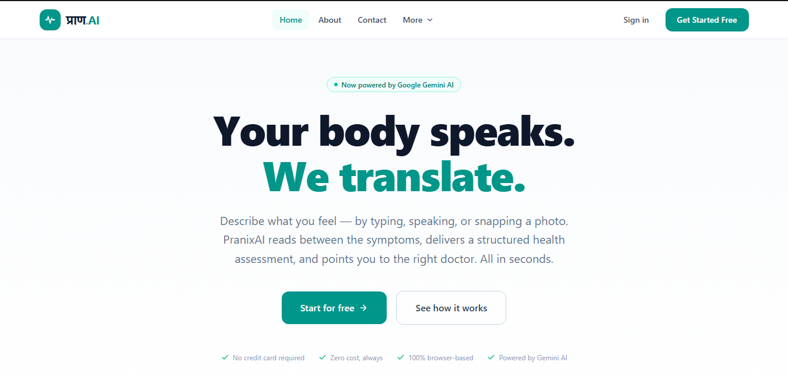
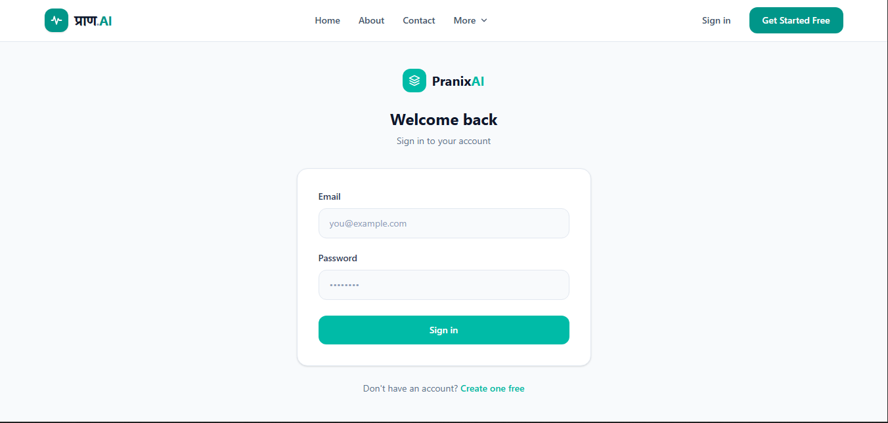
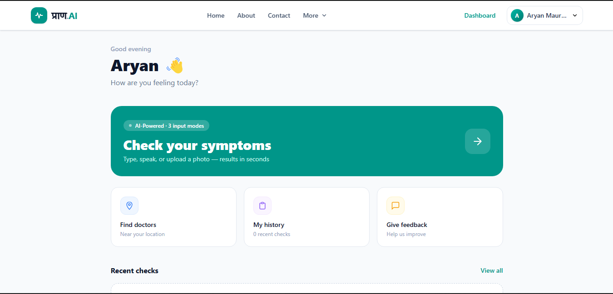
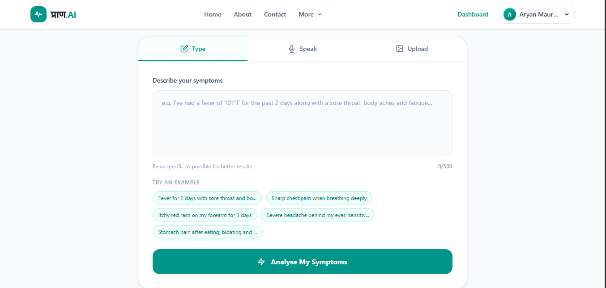
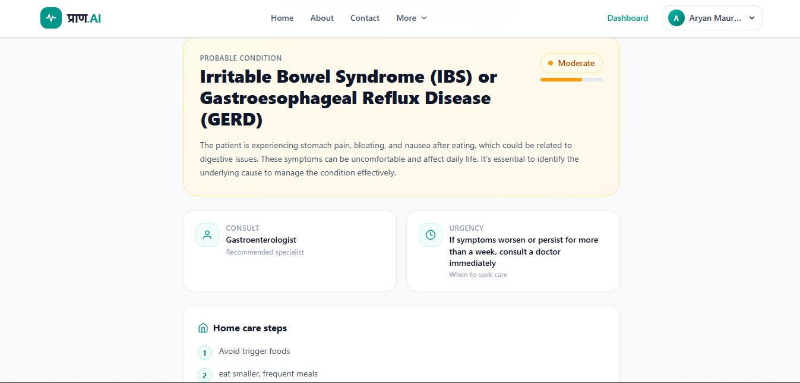
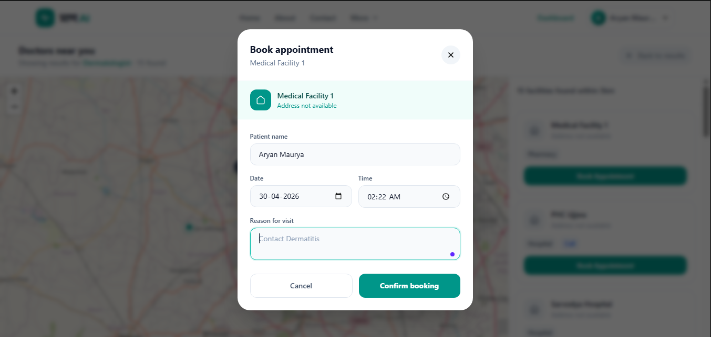
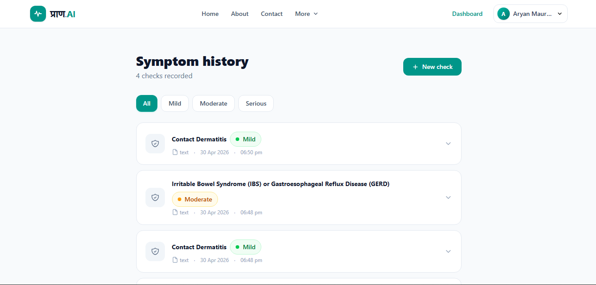

# प्राण.AI — Intelligent Multi-Modal Health Assessment & Care Navigation System

<div align="center">

<br/>


<br/><br/>

### **Your body speaks. We translate.**
*प्राण (Prāṇ) — Sanskrit for Life*

<br/>

[](https://react.dev)
[](https://nodejs.org)
[](https://expressjs.com)
[](https://mongodb.com/atlas)
[](https://tailwindcss.com)
[](https://vitejs.dev)
[](LICENSE)

<br/>

[🌐 Live Demo](https://pran-ai-one.vercel.app) &nbsp;·&nbsp; [✨ Features](#-features) &nbsp;·&nbsp; [🚀 Getting Started](#-getting-started) &nbsp;·&nbsp; [📡 API](#-api-endpoints) &nbsp;·&nbsp; [🔮 Roadmap](#-roadmap)

<br/>

</div>

---

## 📌 What is प्राण.AI?

**प्राण.AI** is a production-grade, full-stack AI-powered health assessment platform. Users describe their symptoms through **text, voice, or image** — and the AI instantly delivers a structured health report including probable condition, severity level, home care steps, and specialist recommendation.

The platform then uses **real-time geolocation** to show nearby matching doctors on a live interactive map — and lets users **book an appointment directly** without leaving the app.

> Built entirely on the MERN stack with Groq AI, deployed at zero cost, and accessible from any browser on any device — no app download required.

---

## 🚨 The Problem

India has **1 doctor per 1,456 patients** — the WHO recommends 1:1,000. But this isn't just an India problem. Globally, millions of people:

- ⏳ Wait hours in queues for **minor, manageable ailments**
- ❌ Consult the **wrong specialist** — wasting time and money
- 📍 Have **no accessible health guidance** in rural or underserved areas
- 💸 Can't afford **subscription-based health apps**

**प्राण.AI** gives everyone instant access to intelligent preliminary health guidance — completely free, in their browser, in seconds.

---

## 🚀 Live Demo

🔗 **Live Website:** https://pran-ai-one.vercel.app

---


## ✨ Features

### Core
- **⌨️ Text Input** — Describe symptoms in plain natural language
- **🎙️ Voice Input** — Speak symptoms via browser-native Web Speech API (no third-party service)
- **📷 Image Input** — Upload photos of rashes, wounds, or skin conditions for AI visual analysis
- **🤖 AI Health Assessment** — Structured report: condition, severity (Mild / Moderate / Serious), home remedies, specialist type, urgency
- **🗺️ Nearby Doctor Finder** — Live interactive map with nearby clinics via OpenStreetMap
- **📅 Appointment Booking** — Book directly inside the app, saved to cloud database
- **📋 Symptom History** — Full history of past assessments with expandable details and severity filters
- **🔐 Secure Auth** — JWT authentication with bcrypt password hashing

### What makes it different

```
✅ Only free platform combining TEXT + VOICE + IMAGE symptom input
✅ AI assessment directly connected to real-time location-based doctor discovery
✅ End-to-end patient journey: symptom → AI report → doctor map → booking
✅ Zero installation — works in any browser on any device
✅ 100% free — no subscriptions, no credit card, no paywalls
```

---

## 🛠️ Tech Stack

### Frontend
| Technology | Purpose |
|---|---|
| React.js v18 | Component-based SPA framework |
| Vite | Build tool & dev server |
| Tailwind CSS | Utility-first styling |
| React Router v6 | Client-side navigation |
| Axios | HTTP client with JWT interceptors |
| Leaflet.js + OpenStreetMap | Interactive maps, zero API cost |
| Web Speech API | Browser-native voice recognition |

### Backend
| Technology | Purpose |
|---|---|
| Node.js + Express.js | REST API server |
| MongoDB Atlas | Cloud NoSQL database |
| Mongoose | ODM / schema management |
| JSON Web Tokens (JWT) | Stateless authentication |
| bcryptjs | Password hashing |
| Groq AI API | LLaMA-powered health assessment |

### Infrastructure
| Service | Role |
|---|---|
| Vercel | Frontend deployment + CDN |
| Render.com | Backend Node.js hosting |
| MongoDB Atlas | Managed cloud database |

---

## 📁 Project Structure

```
Pran.AI/
│
├── client/                          # React + Vite Frontend
│   ├── public/
│   │   └── favicon.svg              # Custom heartbeat icon
│   ├── src/
│   │   ├── pages/
│   │   │   ├── LandingPage.jsx      # Marketing page
│   │   │   ├── Login.jsx
│   │   │   ├── Register.jsx
│   │   │   ├── Dashboard.jsx
│   │   │   ├── SymptomInput.jsx     # ⭐ 3-mode input (text/voice/image)
│   │   │   ├── Results.jsx          # ⭐ AI assessment display
│   │   │   ├── NearbyDoctors.jsx    # Map + doctor list + booking
│   │   │   ├── History.jsx
│   │   │   ├── About.jsx
│   │   │   ├── Contact.jsx
│   │   │   ├── Privacy.jsx
│   │   │   └── Terms.jsx
│   │   ├── components/
│   │   │   ├── Navbar.jsx
│   │   │   ├── Footer.jsx
│   │   │   ├── ProtectedRoute.jsx
│   │   │   ├── VoiceInput.jsx
│   │   │   ├── ImageUpload.jsx
│   │   │   ├── MapView.jsx
│   │   │   ├── DoctorCard.jsx
│   │   │   ├── BookingModal.jsx     # React Portal (above map z-index)
│   │   │   └── SeverityBadge.jsx
│   │   ├── context/
│   │   │   └── AuthContext.jsx
│   │   ├── hooks/
│   │   │   └── usePageTitle.js
│   │   └── utils/
│   │       └── api.js               # Axios instance + auto JWT headers
│   ├── index.html
│   ├── vite.config.js
│   └── package.json
│
├── server/                          # Node.js + Express Backend
│   ├── controllers/
│   │   ├── authController.js
│   │   ├── symptomController.js     # Groq AI integration
│   │   └── doctorController.js      # OpenStreetMap Overpass API
│   ├── models/
│   │   ├── User.js
│   │   ├── SymptomHistory.js
│   │   └── Appointment.js
│   ├── middleware/
│   │   └── authMiddleware.js
│   ├── routes/
│   │   ├── auth.js
│   │   ├── symptoms.js
│   │   └── doctors.js
│   ├── server.js
│   └── package.json
│
└── README.md
```

---

## 📸 Screenshots


### 🏠 Landing Page



### 🔐 Login / Register



### 📊 Dashboard



### 📝 Symptom Input



### 📋 Analysis Result



### 📍 Nearby Doctors


### 📅 Doctor Booking



### 📅 History




## 🚀 Getting Started

### Prerequisites
- [Node.js](https://nodejs.org/) v18+
- [Git](https://git-scm.com/)
- Chrome or Edge (for voice input feature)

### 1. Clone the repo

```bash
git clone https://github.com/Aryanmaurya07/Pran.AI.git
cd Pran.AI
```

### 2. Setup Backend

```bash
cd server
npm install
```

Create `server/.env`:

```env
PORT=5000
MONGO_URI=your_mongodb_atlas_connection_string
JWT_SECRET=your_secret_key_here
GROQ_API_KEY=your_groq_api_key
CLIENT_URL=http://localhost:5173
```

```bash
npm run dev
# ✅ MongoDB connected
# ✅ Server running on port 5000
```

### 3. Setup Frontend

```bash
cd ../client
npm install
```

Create `client/.env`:

```env
VITE_API_URL=http://localhost:5000
```

```bash
npm run dev
# ✅ Open http://localhost:5173
```

---

## 🔑 Environment Variables

### Backend (`server/.env`)

| Variable | Description | Get it from |
|---|---|---|
| `MONGO_URI` | MongoDB connection string | [mongodb.com/atlas](https://mongodb.com/atlas) |
| `JWT_SECRET` | Any long random string | Make it up |
| `GROQ_API_KEY` | Groq AI API key | [console.groq.com](https://console.groq.com) |
| `CLIENT_URL` | Frontend URL | Vercel URL after deploy |
| `PORT` | Server port | Keep as `5000` |

### Frontend (`client/.env`)

| Variable | Description |
|---|---|
| `VITE_API_URL` | Backend server URL |

---

## 📡 API Endpoints

### Auth
| Method | Endpoint | Auth | Description |
|---|---|---|---|
| `POST` | `/api/auth/register` | ❌ | Register new user |
| `POST` | `/api/auth/login` | ❌ | Login, returns JWT |
| `GET` | `/api/auth/me` | ✅ JWT | Get current user |

### Symptoms
| Method | Endpoint | Auth | Description |
|---|---|---|---|
| `POST` | `/api/symptoms/analyze` | ✅ JWT | AI symptom analysis |
| `GET` | `/api/symptoms/history` | ✅ JWT | Get past symptom checks |

### Doctors
| Method | Endpoint | Auth | Description |
|---|---|---|---|
| `GET` | `/api/doctors/nearby` | ✅ JWT | Nearby doctors (OpenStreetMap) |
| `POST` | `/api/doctors/book` | ✅ JWT | Book appointment |
| `GET` | `/api/doctors/bookings` | ✅ JWT | Get user bookings |

---

## 🆚 Comparison

| Feature | प्राण.AI | WebMD | Ada Health | Practo |
|---|---|---|---|---|
| Text input | ✅ | ✅ | ✅ | ❌ |
| **Voice input** | ✅ | ❌ | ❌ | ❌ |
| **Image input** | ✅ | ❌ | ❌ | ❌ |
| AI-powered assessment | ✅ Groq AI | ❌ Rule-based | ✅ Paid | ❌ |
| **Nearby doctor map** | ✅ | ❌ | ❌ | ❌ |
| In-app appointment booking | ✅ | ❌ | ❌ | ✅ Paid |
| **Cost** | **Free** | Free (ads) | Paid | Paid |
| No app download | ✅ | ✅ | ❌ | ❌ |

---

## 🔮 Roadmap

- [ ] 👨‍⚕️ Doctor accounts and management dashboard
- [ ] 📄 Downloadable PDF health report
- [ ] 👨‍👩‍👧 Family health profiles
- [ ] 📊 Symptom progression tracker with charts
- [ ] 🇮🇳 Hindi / bilingual UI support
- [ ] 💊 Medicine reminders with push notifications
- [ ] 🆘 Emergency SOS for critical severity
- [ ] 📱 React Native mobile app
- [ ] 🎥 WebRTC video consultation

---

## 🤝 Contributing

Contributions, issues, and feature requests are welcome.

1. Fork the repo
2. Create your branch: `git checkout -b feature/your-feature`
3. Commit your changes: `git commit -m 'Add your feature'`
4. Push to the branch: `git push origin feature/your-feature`
5. Open a Pull Request

---

## 📄 License

This project is licensed under the **MIT License** — free to use, modify, and distribute.

---

## 👨‍💻 Author

<div align="center">

**Aryan Maurya**

*Full-Stack Developer · MERN Stack · AI Integrations*

[](https://github.com/Aryanmaurya07)

</div>

---

<div align="center">

<br/>

**प्राण (Prāṇ) — Sanskrit for Life**

*Built to make healthcare accessible to everyone, everywhere.*

<br/>

⭐ **If you found this useful, give it a star — it helps a lot!**

</div>
